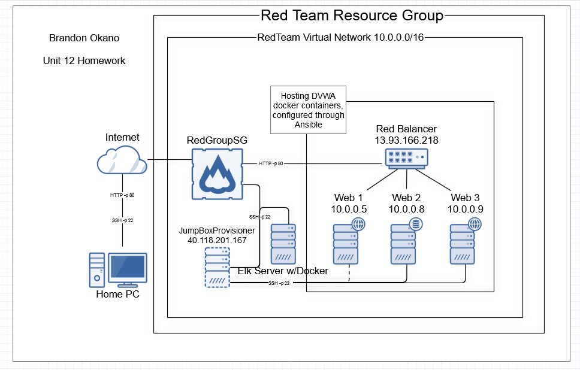
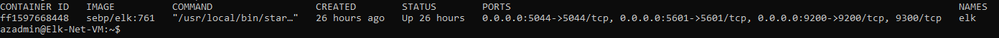

## Automated ELK Stack Deployment

The files in this repository were used to configure the network depicted below.

These files have been tested and used to generate a live ELK deployment on Azure. They can be used to either recreate the entire deployment pictured above. Alternatively, select portions of the ansible file may be used to install only certain pieces of it, such as Filebeat.

This document contains the following details:
- Description of the Topologu
- Access Policies
- ELK Configuration
  - Beats in Use
  - Machines Being Monitored
- How to Use the Ansible Build

### Description of the Topology

The main purpose of this network is to expose a load-balanced and monitored instance of DVWA, the D*mn Vulnerable Web Application.

Load balancing ensures that the application will be highly available for customers, in addition to restricting attacks to the network. 
If a server goes down, the load balancer will then reroute traffic into the servers that are still online.

The advantage of using a jump box is that only the jumpbox has access to the virtual network via SSH. It is closed to the public.

Integrating an ELK server allows users to easily monitor the vulnerable VMs for changes to the log and system traffic.
-Filebeat will monitor logfiles, collect log events and data and will index them Elasticsearch which can be viewed using Kibana.
-Metricbeat monitors the system for any active running processes.

The configuration details of each machine may be found below.

| Name     | Function |               IP Address                  | Operating System |
|----------|----------|-------------------------------------------|------------------|
| Jump Box | Gateway  | Private: 10.0.0.7 Public: 40.118.201.167  | Linux            |
| Web-1    | Server   | Private: 10.0.0.5                         | Linux            |
| Web-2    | Server   | Private: 10.0.0.8                         | Linux            |
|Elk-Server|Monitoring| Private: 10.1.0.4 Public: 40.121.107.210  | Linux            |

### Access Policies

The machines on the internal network are not exposed to the public Internet. 

Only the JumpBox machine can accept connections from the Internet. Access to this machine is only allowed from the following IP addresses:
5061 Kibana Port

Machines within the network can only be accessed by the JumpBoxVM.

A summary of the access policies in place can be found in the table below.

| Name     | Publicly Accessible | Allowed IP Addresses |
|----------|---------------------|----------------------|
| Jump Box | Yes                 | 72.197.56.126        |
| Web-1    | No                  | 10.0.0.7             |
| Web-2    | No                  | 10.0.0.7             |

### Elk Configuration

Ansible was used to automate configuration of the ELK machine. No configuration was performed manually, which is advantageous because it is easy to use and prevents any easily overlooked flaws in the system.

The playbook implements the following tasks:

Install docker.io
Install python3-pip
install docker via pip
Increase vitual memory
Use more memory
Download and launch a docker elk container - starts docker and establishes the ports being used.

The following screenshot displays the result of running `docker ps` after successfully configuring the ELK instance.

### Target Machines & Beats
This ELK server is configured to monitor the following machines:

| Name  | IP Address |
|-------|------------|
| Web-1 |  10.0.0.5  |
| Web-2 |  10.0.0.8  |

We have installed the following Beats on these machines:
Filebeat and Metricbeat
| Name     | IP Address   |
|----------|--------------|
|  Web-1   |   10.0.0.5   |
|  Web-2   |   10.0.0.8   |
|Elk-Server|40.121.107.210|

These Beats allow us to collect the following information from each machine:
-Filebeat collects and shows log data in monitoring clusters
-Metricbeat collects statistics and metrics and shows them in specific outputs (logstash or elasticsearch are examples)

### Using the Playbook
In order to use the playbook, you will need to have an Ansible control node already configured. Assuming you have such a control node provisioned: 

SSH into the control node and follow the steps below:
1. Copy the playbook (.yml) file to Ansible directory.
2. Update the host file to include webserver and ELK.
3. Run the playbook, and navigate to Kibana to check that the installation worked as expected. ( http://[your.VM.IP]:5601/app/kibana ) in my case it was http://40.121.107.210:5601/app/kibana#/home

Answer the following question:

Which file is the playbook? Where do you copy it?
-install-elk.yml and you copy it to /etc/Ansible

Which file do you update to make Ansible run the playbook on a specific machine? How do I specify which machine to install the ELK server on versus which to install Filebeat on?
-The ansible.cfg specifics where and what gets installed to webservers and ELK server.

Which URL do you navigate to in order to check that the ELK server is running?
-http://[your.VM.IP]:5601/app/kibana, in my case it was http://40.121.107.210:5601/app/kibana#/home
